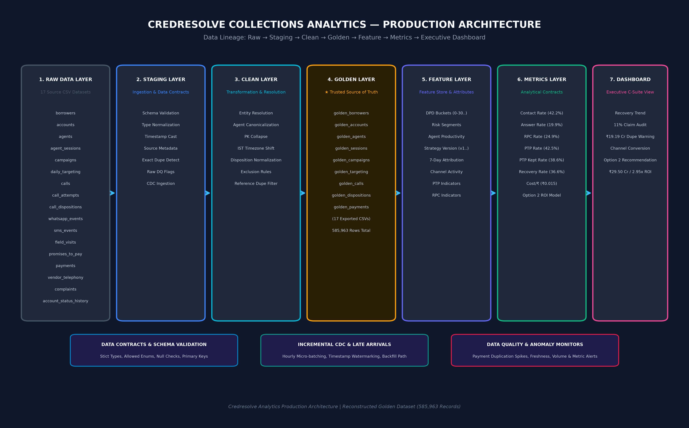

# Credresolve Collections Analytics — Production Architecture

> **Technical Architecture Specification & Production Engineering Guidelines**  
> **Pipeline Flow:** `Raw → Staging → Clean → Golden → Feature → Metrics → Executive Dashboard`  
> **Architecture Diagram:** 

---

## 1. Executive Summary & Pipeline Overview

This document defines the target production data engineering architecture for the Credresolve Collections Analytics system. The architecture is designed to transform high-volume, disparate operational telemetry into trusted, deduplicated analytical metrics supporting executive decision-making and capital allocation models.

### End-to-End Lineage Flow

```
┌────────────┐     ┌─────────────┐     ┌───────────┐     ┌────────────┐     ┌───────────┐     ┌───────────┐     ┌───────────┐
│  RAW DATA  │ ──► │   STAGING   │ ──► │   CLEAN   │ ──► │   GOLDEN   │ ──► │  FEATURE  │ ──► │  METRICS  │ ──► │ DASHBOARD │
│ (17 Tables)│     │ Ingestion & │     │ Transform │     │ (Option A) │     │  Store &  │     │ Contracts │     │ Executive │
│ 639K Rows  │     │ Data Cont.  │     │ Resolution│     │ 586K Rows  │     │ Attributes│     │ Engine    │     │ UI        │
└────────────┘     └─────────────┘     └───────────┘     └────────────┘     └───────────┘     └───────────┘     └───────────┘
```

---

## 2. Layer Specifications

### 2.1 RAW DATA LAYER (Source Ingestion)
- **Scope:** 17 operational CSV datasets capturing borrower profiles, loan accounts, agent sessions, communications, call attempts, field visits, PTPs, and payment transactions (639,185 raw rows total).
- **Source Tables:** `borrowers`, `accounts`, `agents`, `agent_sessions`, `campaigns`, `daily_targeting`, `calls`, `call_attempts`, `call_dispositions`, `whatsapp_events`, `sms_events`, `field_visits`, `promises_to_pay`, `payments`, `vendor_telephony`, `complaints`, `account_status_history`.
- **Ingestion Mode:** Batch and micro-batch append into append-only raw tables.

### 2.2 STAGING LAYER (Ingestion & Validation)
- **Responsibilities:**
  - **Schema Validation:** Strict type casting (`TIMESTAMP`, `BIGINT`, `NUMERIC(15,2)`).
  - **Metadata Enrichment:** Appending `_ingested_at`, `_source_file`, `_batch_id`.
  - **Raw Data Quality Checks:** Ingestion-time flagging of backward timestamp ordering (`updated_at < created_at`), missing contact info, and malformed strings.
  - **Exact Duplicate Detection:** Partitioned window functions (`ROW_NUMBER() OVER (...)`) identifying 2,957 exact duplicate records.

### 2.3 CLEAN LAYER (Transformation & Resolution)
- **Responsibilities:**
  - **Entity Resolution:** Standardizing borrower, account, and agent keys.
  - **Surrogate PK Collapse & Reference Deduplication:** Merging surrogate key variations and resolving payment reference duplications (dropping 50,265 invalid/redundant records).
  - **Timezone Normalization:** Converting UTC timestamps to Indian Standard Time (IST / UTC+5:30).
  - **Disposition Normalization:** Standardizing telephony vendor call disposition codes (`ANSWERED`, `BUSY`, `NO_ANSWER`, `FAILED`).
  - **Exclusion Rules:** Filtering out test accounts and corrupted legacy entries.

### 2.4 GOLDEN LAYER (Trusted Source of Truth)
- **Definition:** Option A Reconstructed Golden Dataset consisting of **17 clean, relational business tables** totaling **585,963 records**.
- **Role:** Represents the single, immutable analytical source of truth for all business reporting, audit checks, and model training.
- **Exported Entities:** `golden_borrowers`, `golden_accounts`, `golden_agents`, `golden_agent_sessions`, `golden_campaigns`, `golden_daily_targeting`, `golden_calls`, `golden_call_attempts`, `golden_call_dispositions`, `golden_whatsapp_events`, `golden_sms_events`, `golden_field_visits`, `golden_promises_to_pay`, `golden_payments` (22,813 deduplicated rows), `golden_vendor_telephony`, `golden_complaints`, `golden_account_status_history`.

### 2.5 FEATURE LAYER (Feature Store & Analytical Attributes)
- **Responsibilities:** Computes granular entity-level analytical features for segmentation and modeling.
- **Key Features:**
  - **Account & Portfolio Features:** DPD buckets (`0-30`, `31-60`, `61-90`, `91-180`), Risk Segment (`LOW`, `MEDIUM`, `HIGH`), Principal Balance, Outstanding Amount.
  - **Operational & Agent Features:** Agent Tenure, Monthly Active Hours, Call Capacity.
  - **Strategy & Attribution Features:** Campaign Strategy Version (`v1/legacy` vs `v2/v3`), 7-Day Last-Touch Multi-Channel Attribution, Telephony Vendor.
  - **Behavioral Indicators:** Contacted Indicator, RPC Indicator, PTP Formed Indicator, PTP Kept Indicator.

### 2.6 METRICS LAYER (Uncapped Metric Engine)
- **Responsibilities:** Standardized business metric contract execution over the Golden & Feature layers.
- **Key Metric Contracts:**
  - **Contact Rate:** `contacted_accounts / targeted_accounts` (42.2% avg).
  - **Call Answer Rate:** `answered_calls / total_calls` (19.9% avg).
  - **RPC Rate:** `rpc_accounts / accounts_called` (24.9% avg).
  - **PTP Rate (Targeted):** `ptp_accounts / targeted_accounts` (42.5% avg).
  - **PTP Rate (Called):** `ptp_accounts / accounts_called` (23.5% avg).
  - **PTP Kept Rate:** `ptp_kept_accounts / ptp_accounts` (38.6% avg).
  - **Recovery Rate:** `recovered_accounts / targeted_accounts` (36.6% avg; Jan: 40.1% → Jul: 32.5%).
  - **Cost per ₹ Recovered:** `(agent_hours * ₹250) / recovered_amount` (₹0.015).

### 2.7 EXECUTIVE DASHBOARD LAYER (Presentation)
- **Capabilities:** Interactive visual reporting rendering recovery trends, data quality alerts, counterfactual strategy evaluation, and investment allocation modeling.
- **Key Cards & Insights:**
  - **Reported vs Actual Recovery:** Highlighted ₹19.19 Cr (14.31%) payment duplication inflation.
  - **11% Claim Investigation:** Verification showing raw 10.99% Feb-Mar growth was driven by payment duplication.
  - **Option 2 Investment Recommendation:** ₹10 Cr Capital → 238 Agents → ₹29.50 Cr/yr Incremental Recovery (2.95x ROI | ~4.1 Months Break-even | LOW Confidence).

---

## 3. Production Engineering & Operational Controls

### 3.1 Data Contracts
Production pipelines enforce strict JsonSchema & SQL DDL data contracts at the Staging interface:
- **Schema Validation:** Field names, data types, and non-null constraints (`account_id`, `payment_reference`, `event_at`).
- **Domain Constraints:** Payment status must belong to `{'SUCCESS', 'FAILED', 'PENDING'}`; DPD must be non-negative integer $\ge 0$.

### 3.2 Primary Keys & Entity Integrity
- `borrower_id` (UUID v4)
- `account_id` (UUID v4)
- `agent_id` (UUID v4)
- `payment_reference` (Canonical Unique Payment Key)
- `event_id` / `call_id` (Transaction Unique Keys)

### 3.3 Data Lineage & Traceability
Every Golden table record retains upstream data lineage columns:
- `_raw_source_id`: Upstream raw record pointer.
- `_dedupe_method`: Applied deduplication rule (`EXACT_ROW_DROP` or `SURROGATE_MERGE`).
- `_processed_at`: Transformation timestamp.

### 3.4 Incremental Processing (CDC)
- Production ingestion uses **Change Data Capture (CDC)** based on high-watermark timestamps (`updated_at` / `event_at`).
- Micro-batch processing runs hourly, processing only records where `updated_at > LAST_WATERMARK`.

### 3.5 Late-Arriving Data Handling
- Payment settlement events arriving up to **30 days post-collection** trigger an automated state update across Clean, Golden, Feature, and Metrics layers.
- Metric views utilize dynamic window functions (`event_at::date`) to place late payments into their correct historical accounting month.

### 3.6 Backfill Strategy
- A dedicated backfill workflow allows re-processing historical date partitions (`YEAR=2026/MONTH=03`) without interrupting live CDC ingestion.
- Uses atomic partition swapping (`ALTER TABLE ... REPLACE PARTITION`) to prevent dashboard downtime during historical re-runs.

### 3.7 Data Quality Audit Checks
Automated DAG assertion tasks execute post-ingestion:
1. **Null Check:** Zero nulls allowed in primary keys or financial amounts.
2. **Referential Integrity Check:** 100% of payment `account_id` references must exist in `golden_accounts`.
3. **Reconciliation Check:** $Raw - Dropped - Corrected = Golden$ (Strict arithmetic validation: $639,185 - 2,957 - 50,265 = 585,963$).

### 3.8 Monitoring & Alerting
- **Pipeline Freshness Monitoring:** Alert generated if Golden dataset is not updated within 120 minutes of source transaction.
- **Volume Anomaly Alerts:** Triggered if daily row counts deviate by $> 25\%$ from 30-day moving average.

### 3.9 Anomaly Detection
- **Payment Duplication Spike Monitor:** Real-time alert if duplicate payment reference ratio exceeds $2.0\%$ of daily transactions.
- **Recovery Volatility Alert:** Automatic trigger if daily recovered amount drops by $> 15\%$ MoM without changes in targeted volume.

### 3.10 Failure & Recovery Strategy
- **Idempotent Ingestion:** All pipeline transformations are strictly idempotent (`INSERT OVERWRITE` or `UPSERT`).
- **Dead Letter Queue (DLQ):** Unparseable or corrupted raw records are isolated into `staging.dlq_quarantine` for manual investigation without stopping pipeline execution.
